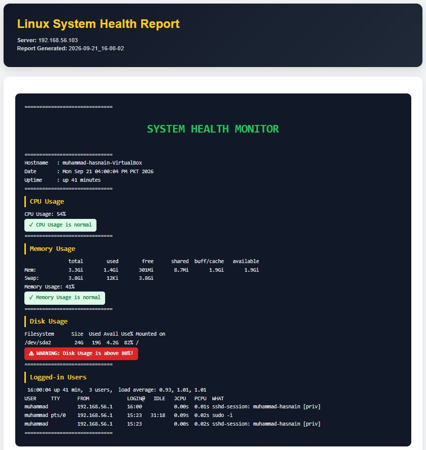
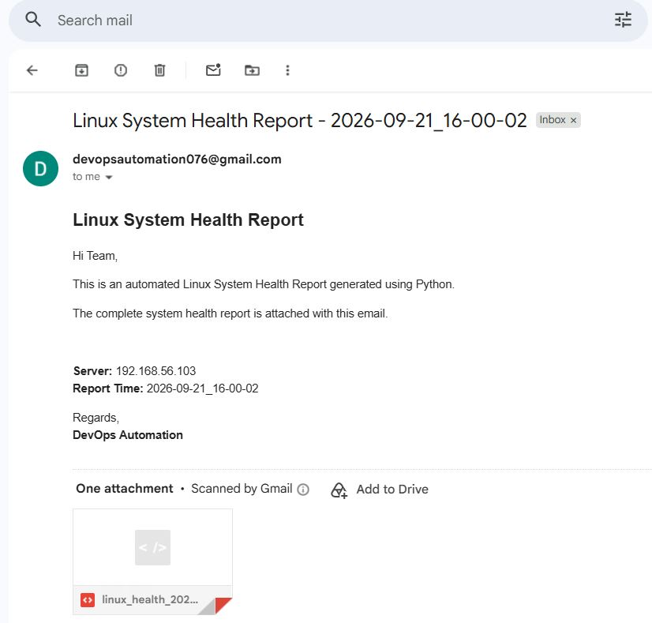
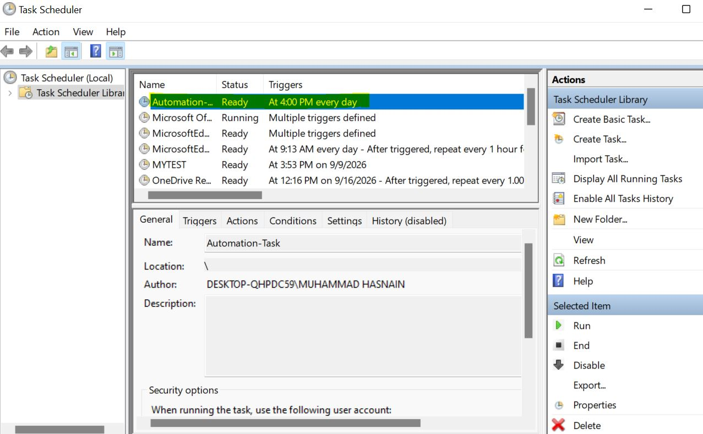

# Linux Health Report Automation

A personal DevOps automation project that monitors a Linux VM's health and delivers a styled HTML report by email every day.

> Built as a lab project (Ubuntu VM on VirtualBox) to practice Bash, Python automation and scheduling.

## How it works

1. **Bash script** (`linux/health_monitor.sh`) runs on the Linux VM and checks CPU, memory, disk usage and logged-in users. It prints a warning when any of CPU, memory or disk goes above 80%.
2. **Python script** (`automation-project.py`) running on Windows:
   - Connects to the VM over SSH using Paramiko
   - Runs the Bash script and captures its output
   - Converts the output into a styled HTML report (green badges for normal status, red badges for warnings)
   - Saves the report locally and emails it as an attachment using SMTP
3. **Windows Task Scheduler** runs the Python script automatically every day at a fixed time using a batch file (`task.bat`), so the whole pipeline works without manual effort.

## Screenshots

### HTML report


### Email received


### Task Scheduler


## Tech stack

- Bash scripting
- Python 3 (Paramiko, smtplib, pathlib)
- HTML / CSS
- Windows Task Scheduler
- VirtualBox, Ubuntu

## Project structure

```
.
├── automation-project.py     # SSH, report generation, email
├── task.bat                  # Batch file used by Task Scheduler
├── linux/
│   └── health_monitor.sh     # Runs on the Linux VM
├── screenshots/
└── README.md
```

## Setup

1. Copy `linux/health_monitor.sh` to the VM and make it executable:
```
   chmod +x health_monitor.sh
```
2. Install the dependency on Windows:
```
   pip install paramiko
```
3. Set these environment variables (credentials are never stored in the code):
   - `VM_PASSWORD`: SSH password of the VM
   - `GMAIL_APP_PASSWORD`: Gmail App Password for sending mail
4. Update `hostname`, `username` and the output folder in `automation-project.py`.
5. Run:
```
   python automation-project.py
```

## Scheduling (Windows Task Scheduler)

`task.bat` runs the Python script. In Task Scheduler create a Daily trigger and point the action to `task.bat`. Paths inside `task.bat` are specific to my machine, so update them for yours.

## What I learned

- Running remote commands over SSH with Paramiko
- Writing Bash scripts with threshold-based warnings
- Generating styled HTML reports from Python
- Sending emails with attachments via SMTP
- Keeping credentials out of source code using environment variables
- Automating a workflow with Windows Task Scheduler

## Author

Muhammad Hasnain